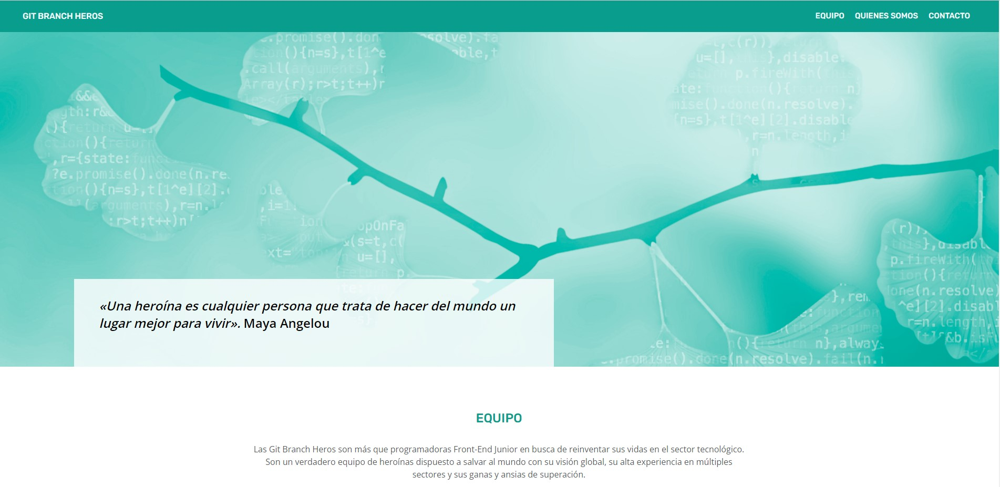
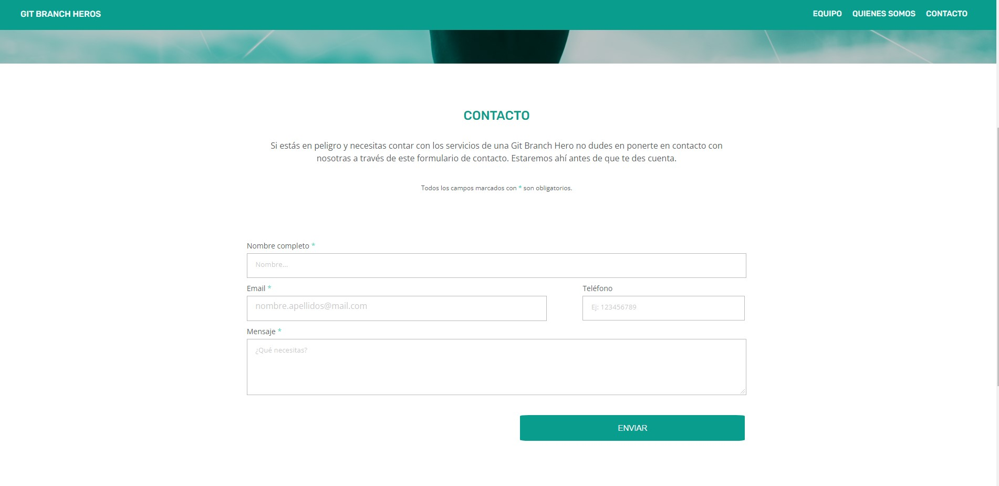

# Git Branch Heros

**Git Branch Heros** is a full responsive **HTML and SASS (SCSS)** website mocked-up and created by four Junior Front - End Developers as part of their final project of Adalab's Web Development Bootcamp Module 1.

Given a design, they have developed a completely new customized website implementing the subsequent guidelines:

1. The website had to be fully responsive for the most common mobile, tablet and desktop screen sizes meaning all measures had to be as responsive as possible.

2. Both Grid and Flexbox models had to be used in order to learn as much as possible from both of them.

3. The project had to be developed as a team, experiencing the benefits Mob Programming and Pair Programming can provide.

4. All the project had to be developed in Github's platform, including project planning, Github Pages hosting and creation of the repository among others.

5. Both an **"Index"** and a **"Contact Form"** pages had to be created.

Taking all these features into account the "Git Branch Heros" team has developed a fully customized website introducing the following new features to improve user's experience:

1. **Hover** and **Active** pseudo-classes when clicking on links.

2. **Animations and Transforms** on images.

3. **Texts, titles and sections** completely customized following a "heroes" topic (according to the name of the team).

4. **A fully operative "navigation bar"** you will be able to use to travel all around the page and contact form.

If you want to take a look, don't hesitate and go to our GitHub Pages Link attached in the description of this repository.

Thanks for your attention and we hope you enjoy our work!

**_Project mocked up and created by Marta Castrillo, Úrsula Borrego, Virginia Menéndez and Yara Paz_**

### Authors:
- [@martaCastrillo](https://github.com/martscastrillo)
- [@virginiaMenendez](https://github.com/VirginiaMSordo)
- [@ursulaBorrego](https://github.com/UrsulaBorrego)
- [@yarapaz](https://github.com/yarapaz)
